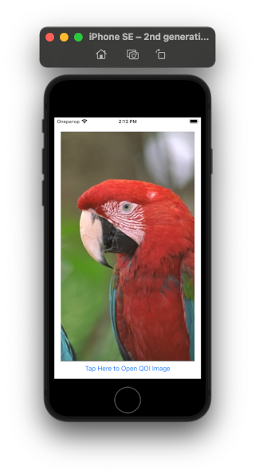
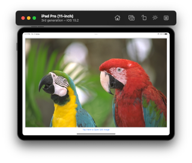
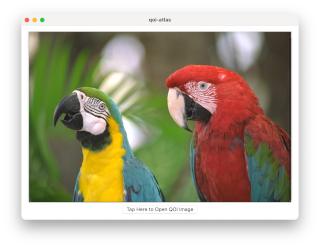

# QOI-Atlas
QOI image file viewer for Apple platform (iOS, macOS Catalyst)

# iOS Pro Course
https://otus.ru/lessons/advanced-ios

# QOI - The “Quite OK Image Format” for fast, lossless image compression
https://github.com/phoboslab/qoi

Test images in QOI and PNG format  
https://qoiformat.org/qoi_test_images.zip

# Features
Open and view QOI images in app  
Open and view QOI images by "Share" button  

# Screenshots

